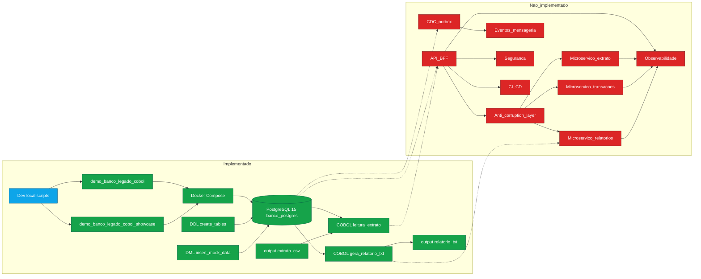

# 🏦 Banco Legado COBOL

Simulação de um **core bancário legado** utilizando **COBOL** e **PostgreSQL**, estruturado para demonstrar como sistemas críticos “mainframe-like” podem ser executados localmente e modernizados de forma incremental.

> **Nota (mudança de stack):** o projeto começou com **Db2**, mas foi migrado para **PostgreSQL** por compatibilidade/execução mais simples no macOS.

---

## 🎯 Objetivo

Demonstrar, de ponta a ponta:

- Um domínio bancário mínimo (clientes, contas, transações)
- Um “core” em COBOL que lê/gera saídas (extrato/relatório)
- Infra local via Docker para levantar o banco
- Uma base para discutir modernização (Strangler, APIs, etc.)

---

## 🏗️ Visão de Arquitetura

```text
+-------------------------+
|       COBOL Core        |
|  (programas batch/tela) |
+------------+------------+
             |
             v
+-------------------------+
|       PostgreSQL        |
| (persistência via SQL)  |
+------------+------------+
             |
             v
+-------------------------+
|   Infra (Docker/Compose)|
+-------------------------+
```

---

## 📁 Estrutura do Projeto (atual)

```text
banco-legado-cobol/
├── cobol-core/
│   └── src/
│       ├── leitura_extrato.cob        # Programa COBOL (tela) para leitura de extrato
│       ├── gera_relatorio_txt.cob     # Programa COBOL (batch) para gerar relatório em TXT
│       ├── extrato/                   # Binário/artefatos gerados (quando compilado)
│       └── gera_relatorio_txt/        # Binário/artefatos gerados (quando compilado)
├── PostgreSQL/
│   ├── ddl/
│   │   └── 📄 create_tables.sql        # DDL (clientes, contas, transacoes)
│   └── dml/
│       └── insert_mock_data.sql       # Carga inicial (mock)
├── infra/
│   └── docker/
│       ├── compose.yml                # PostgreSQL (container: banco-postgres)
│       ├── start.sh                   # Sobe o compose
│       └── stop.sh                    # (placeholder) parar ambiente
├── output/
│   ├── extrato.csv                    # Saída/insumo de exemplo
│   └── relatorio.txt                  # Gerado pelo COBOL (quando executado)
├── demo_banco_legado_cobol.sh         # Demo automatizada (passo a passo)
├── demo_banco_legado_cobol_showcase.sh# Demo automatizada (modo “apresentação”)
├── README.md
└── Readme.txt                         # Guia rápido (anotações)
```

---

## ✅ Pré-requisitos

- Docker Desktop (ou Docker Engine) com suporte a `docker compose`
- GnuCOBOL (`cobc`) instalado
- macOS / Linux (scripts `*.sh`)

---

## ⚙️ Como executar (fluxo real do projeto)

### 1) Subir o PostgreSQL via Docker

```bash
cd infra/docker
docker compose up -d
```

O container sobe como **`banco-postgres`** com as credenciais:

- usuário: `admin`
- senha: `admin`
- database: `banco`
- porta: `5432`

### 2) Criar tabelas e inserir dados mock

Você pode executar os scripts SQL dentro do container.

Criar tabelas:

```bash
docker exec -i banco-postgres psql -U admin -d banco < "../../PostgreSQL/ddl/📄 create_tables.sql"
```

Inserir mock:

```bash
docker exec -i banco-postgres psql -U admin -d banco < "../../PostgreSQL/dml/insert_mock_data.sql"
```

### 3) Validar com consultas

```bash
docker exec -it banco-postgres psql -U admin -d banco
```

Dentro do `psql`:

```sql
SELECT * FROM clientes;
SELECT * FROM contas;
SELECT * FROM transacoes;
```

Para simular um extrato (cliente 1):

```sql
SELECT 
    c.nome,
    co.saldo,
    t.tipo,
    t.valor,
    t.data
FROM clientes c
JOIN contas co ON c.id = co.cliente_id
JOIN transacoes t ON co.id = t.conta_id
WHERE c.id = 1
ORDER BY t.data DESC;
```

### 4) Compilar e executar os programas COBOL

```bash
cd ../../cobol-core/src

# Programa de tela
cobc -x leitura_extrato.cob -o extrato
./extrato

# Programa batch (gera arquivo em output/)
cobc -x gera_relatorio_txt.cob -o gera_relatorio_txt
./gera_relatorio_txt
```

Saídas esperadas:

- `output/relatorio.txt`
- (dependendo do fluxo) leituras/escritas usando `output/extrato.csv`

---

## 🎬 Scripts de demo

- `demo_banco_legado_cobol.sh`: executa o fluxo completo (Docker → queries → compila/roda COBOL → valida `output/`)
- `demo_banco_legado_cobol_showcase.sh`: variação com banner/estilo para apresentação

Para rodar:

```bash
chmod +x demo_banco_legado_cobol.sh demo_banco_legado_cobol_showcase.sh
./demo_banco_legado_cobol_showcase.sh
```

Dica: sem pausas entre etapas:

```bash
INTERACTIVE_DEMO=0 ./demo_banco_legado_cobol_showcase.sh
```

---

## 🧩 Modelo de Dados (PostgreSQL)

Tabelas:

- `clientes(id, nome)`
- `contas(id, cliente_id, saldo)`
- `transacoes(id, conta_id, tipo, valor, data)`

Scripts:

- DDL: `PostgreSQL/ddl/📄 create_tables.sql`
- DML: `PostgreSQL/dml/insert_mock_data.sql`

---

## 🗺️ Modernização (direção do projeto)

Possíveis próximos passos:

- Expor o core via API (ex.: FastAPI) como camada anti-corruption
- Observabilidade (logs estruturados, tracing)
- “Strangler Pattern” para substituir partes do legado com baixo risco

---

## 🚧 Pendências técnicas

- `infra/docker/stop.sh` ainda não está implementado (placeholder)
- Automatizar carga do SQL no `docker compose` (init scripts) para `up` já subir com schema+mock
- Integração direta COBOL ↔ PostgreSQL (ex.: ODBC) caso o objetivo evolua

---

## 📌 Autor

Rodrigo Sena de Oliveira
Arquiteto de Soluções | Especialista em modernização de sistemas críticos

---

# ⚙️ Como construir isso passo a passo (guia real)

## 🔹 Etapa 1 — Criação inicial

```bash
mkdir banco-legado-cobol
cd banco-legado-cobol
git init
touch README.md
```

👉 Cole o conteúdo acima

---

## 🔹 Etapa 2 — Primeiro commit (importante estrategicamente)

```bash
git add .
git commit -m "feat: initial architecture and project structure for legacy banking simulation"
```

👉 Esse commit já comunica senioridade

---

## 🔹 Etapa 3 — Subir no GitHub

```bash
git remote add origin <seu-repo>
git push -u origin main
```

---

# ⚖️ Decisões e Trade-offs (Arquitetura atual)

Esta arquitetura foi desenhada para **simular um banco legado de forma rápida e reproduzível**, com objetivo de **testar/validar padrões arquiteturais de modernização** (ex.: Strangler Pattern, extração incremental de capacidades do monólito, APIs/anti-corruption layer) em um cenário próximo do que existe em bancos e grandes empresas.

## Decisões

- **COBOL como “core legado”**
  - **Por quê:** representa um monólito legado típico (batch/tela, forte acoplamento a arquivos/processos, evolução lenta).
  - **Trade-off:** não busca a melhor DX; busca realismo do legado.

- **PostgreSQL no lugar de Db2**
  - **Por quê:** viabiliza execução local no macOS com baixo atrito (Docker), mantendo o modelo relacional e SQL próximo do mundo corporativo.
  - **Trade-off:** perde-se fidelidade 1:1 com ambientes Db2/mainframe, mas ganha-se velocidade para experimentação.

- **Docker Compose para infraestrutura**
  - **Por quê:** provisionamento consistente (“rodar em qualquer máquina”), reproducibilidade de demo e facilidade de reset do ambiente.
  - **Trade-off:** ainda não há automação completa de init (schema + carga) no `compose` — hoje depende de execução manual ou scripts.

- **Separação por pastas (core / infra / SQL / output)**
  - **Por quê:** espelha uma separação por responsabilidades comum em modernizações reais:
    - `cobol-core/`: domínio e processamento legado
    - `PostgreSQL/`: contratos de dados (DDL/DML)
    - `infra/`: ambiente de execução
    - `output/`: artefatos gerados (evidência do batch)
  - **Trade-off:** ainda não é uma decomposição em serviços; é uma base organizada para evoluir.

- **Scripts de demo como “pipeline executável”**
  - **Por quê:** o projeto prioriza **ser demonstrável** (rodar do zero ao extrato/relatório) para validar hipóteses de arquitetura e orientar discussões.
  - **Trade-off:** scripts podem ficar opinativos (paths/nomes), mas dão previsibilidade de execução.

- **Foco em cenário mínimo (clientes/contas/transações)**
  - **Por quê:** reduz escopo para validar padrões (observabilidade, extração de serviços, contratos) sem virar um “ERP gigante”.
  - **Trade-off:** não cobre todas as complexidades bancárias; é um recorte intencional.

## Como isso ajuda a testar migração monólito → microserviços

- Permite tratar o COBOL como **“sistema de registro”** e criar ao redor:
  - uma camada de **API** (futuro) como anti-corruption layer
  - **extração incremental de capacidades** (ex.: extrato, relatório, transações) para serviços independentes
  - experimentos com **sincronização de dados**, eventos, CDC (futuro)

---

## 🔎 Diagrama (Mermaid) — O que existe vs. o que é visão de modernização



- **Verde:** implementado e executavel no repositorio.
- **Vermelho:** visao/roadmap (microservicos e boas praticas de modernizacao).

